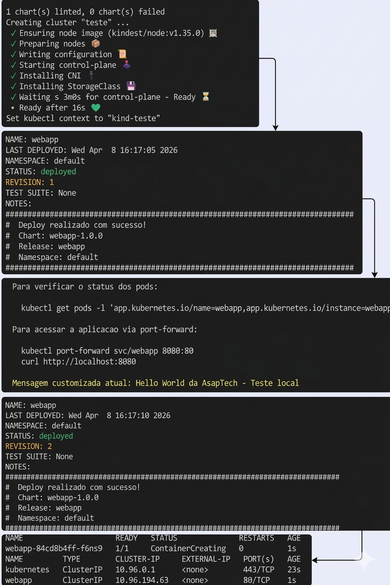
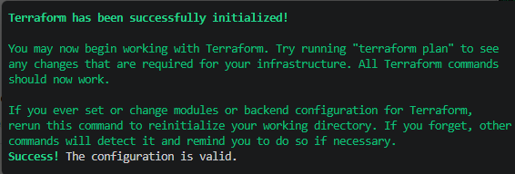
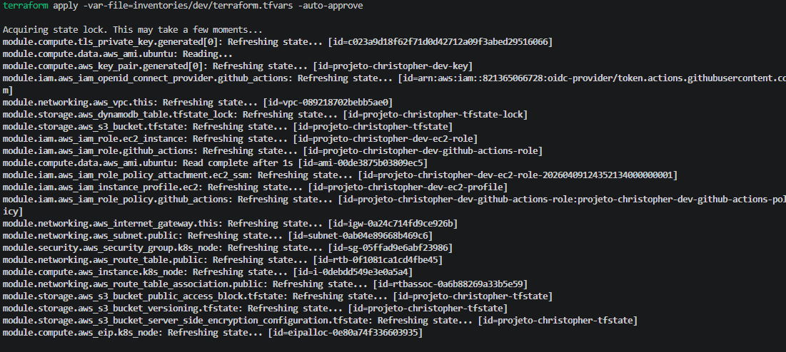
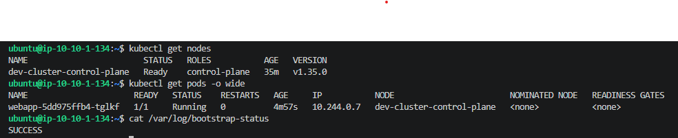
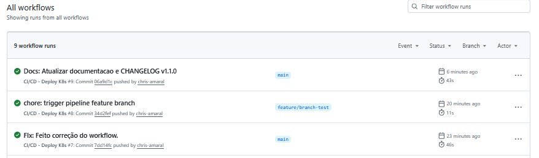

# DevOps-CICD

Infraestrutura como Codigo (IaC) e automacao de deploy para cluster Kubernetes na AWS.

---

## Quick Start

### Pre-requisitos

- AWS CLI configurado (`aws configure`)
- Terraform >= 1.5.0
- Bash (Linux/macOS/WSL)

### 1. Personalizar (unico arquivo)

```bash
vi terraform/inventories/dev/terraform.tfvars
```

```hcl
project_name       = "meu-projeto"         # Prefixo dos recursos
owner              = "seu.nome"            # Tag Owner
github_repository  = "seu-user/seu-repo"   # OIDC trust policy
```

### 2. Provisionar tudo

```bash
cd terraform
chmod +x setup.sh
./setup.sh dev
```

O script faz tudo automaticamente:
- Gera `backend.hcl` com bucket S3 unico (inclui AWS Account ID)
- Cria S3 + DynamoDB para state remoto
- Provisiona VPC, EC2, Security Groups, IAM com OIDC
- Exporta chave SSH para `terraform/ssh-key-dev.pem`

Ao final exibe: IP da EC2, Role ARN, comando SSH e GitHub Secrets.

### 3. Conectar na EC2

```bash
ssh -i ssh-key-dev.pem ubuntu@<IP_EXIBIDO>
```

Aguarde ~5-8 min para o bootstrap (Docker + Kind + kubectl + Helm).

```bash
cat /var/log/bootstrap-status    # SUCCESS = pronto
kubectl get nodes                # Ready
```

### 4. Configurar GitHub Secrets

Em **Settings > Secrets > Actions**, crie com os valores exibidos pelo setup.sh:

| Secret | Valor |
|--------|-------|
| `AWS_ROLE_ARN` | ARN exibido pelo setup.sh |
| `EC2_INSTANCE_ID` | Instance ID exibido pelo setup.sh |
| `EC2_SSH_HOST` | IP exibido pelo setup.sh |
| `EC2_SSH_PRIVATE_KEY` | Conteudo do arquivo `ssh-key-dev.pem` |

### 5. Trigger do pipeline

```bash
git add .
git commit -m "chore: trigger pipeline"
git push origin main
```

O pipeline faz: Helm Lint → OIDC Auth → SSH → `helm upgrade --install` → Smoke Test.

### 6. Validar deploy

```bash
# Na EC2
kubectl get pods    # 1/1 Running
helm list           # STATUS: deployed
```

### 7. Destruir recursos

```bash
chmod +x teardown.sh
./teardown.sh dev
```

---

## Estrutura

```
.
├── .github/workflows/ci-deploy-k8s.yml    # Pipeline CI/CD
├── charts/webapp/                          # Helm Chart generico
├── terraform/
│   ├── setup.sh                           # Bootstrap automatizado
│   ├── teardown.sh                        # Destruir recursos
│   ├── inventories/dev/terraform.tfvars   # Variaveis (unico arquivo para editar)
│   └── modules/                           # networking, compute, security, storage, iam
└── docs/                                  # Runbooks, Playbooks, ADR
```

---

## Stack

| Ferramenta | Funcao |
|------------|--------|
| **Terraform** | 5 modulos reusaveis, inventories por ambiente, Elastic IP, OIDC |
| **Helm** | Chart generico `webapp` — qualquer imagem, resource limits, HPA, probes |
| **Kind** | Cluster Kubernetes (Docker-based) na EC2 |
| **GitHub Actions** | CI/CD com OIDC, GitFlow (main/develop/feature/release/hotfix) |

---

## OIDC — Zero credenciais estaticas

```
GitHub Actions → JWT assinado → AWS STS → Credenciais temporarias (~1h)
```

O pipeline nao usa `AWS_ACCESS_KEY_ID`. Toda autenticacao e via OpenID Connect.

---

## Evidencias

### Validacao Helm Chart (Kind)



### Terraform





### EC2 + Pipeline





---

## Documentacao

| Tipo | Documento |
|------|-----------|
| Runbook | [Terraform Setup](docs/runbook-terraform-setup.md) |
| Runbook | [Helm Chart](docs/runbook-helm-chart.md) |
| Runbook | [CI/CD Pipeline](docs/runbook-ci-cd-pipeline.md) |
| Runbook | [Validacao de Deploy](docs/runbook-validacao-deploy.md) |
| Playbook | [Incident Response](docs/playbook-incident-response.md) |
| Playbook | [Rollback](docs/playbook-rollback.md) |
| Playbook | [Scaling](docs/playbook-scaling-performance.md) |
| ADR | [Decisoes Tecnicas](docs/adr-001-decisoes-tecnicas.md) |
| Referencia | [Security Baseline](docs/security-baseline.md) |
| Referencia | [Links](docs/links-e-referencias.md) |

---

## Diferenciais

| Camada | O que foi feito |
|--------|----------------|
| **Terraform** | 5 modulos, inventories (dev/homol/prod), setup.sh automatizado, bucket S3 com account ID |
| **Helm** | Chart generico, NetworkPolicy, HPA, probes, values de producao, checksum annotation |
| **CI/CD** | GitFlow, OIDC, concurrency control, path filter, smoke test |
| **Seguranca** | IMDSv2, EBS encriptado, S3 bloqueado, SG least-privilege, zero static keys |

---

**Autor**: Christopher Amaral | DevOps Engineer
**Contato**: christopheramaral1996@gmail.com
**LinkedIn**: [christopher-amaral](https://www.linkedin.com/in/christopher-amaral-6788b0359)
