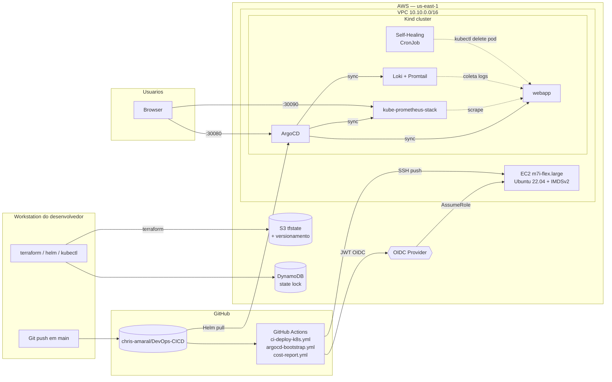
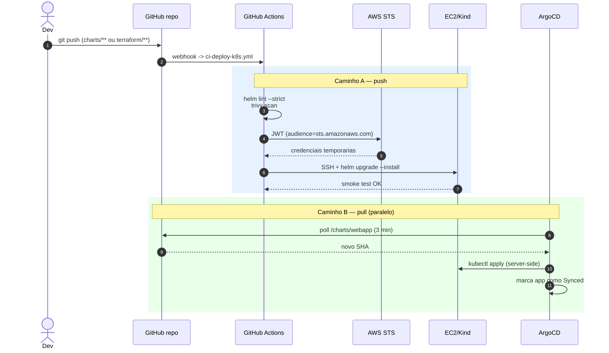
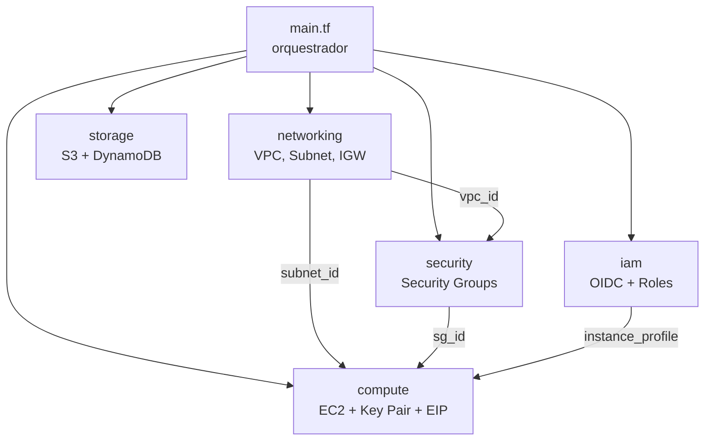
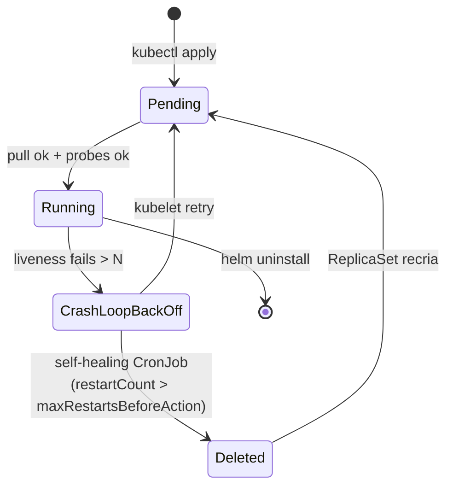

# Arquitetura — chris-platform

> Diagramas Mermaid renderizados nativamente pelo GitHub. Mantenedor: chris-amaral

---

## Visao geral (camadas)

---

## Fluxo de deploy (push vs pull)

---

## Modulos Terraform — dependency injection

---

## Estados do pod webapp (com self-healing ativo)

---

## Onde isto se conecta com o CV

| Bloco do diagrama | Item do CV reproduzido |
|-------------------|------------------------|
| OIDC + IAM Roles | Itau Latam — provisionamento AWS com OIDC |
| ArgoCD + App-of-Apps | iFood/Zoop — auditoria de deploy via Git |
| Self-Healing CronJob | iFood/Zoop — sistema de Self-Healing reduzindo MTTR |
| kube-prometheus-stack + Loki | Datadog/Grafana/Prometheus/Loki/Graylog (varios) |
| Cost Report (Python) | Itau Latam — automacoes em Python no GitHub Actions |
| DR Playbook | EDCS — jobs de backup/restore SQL Server |
